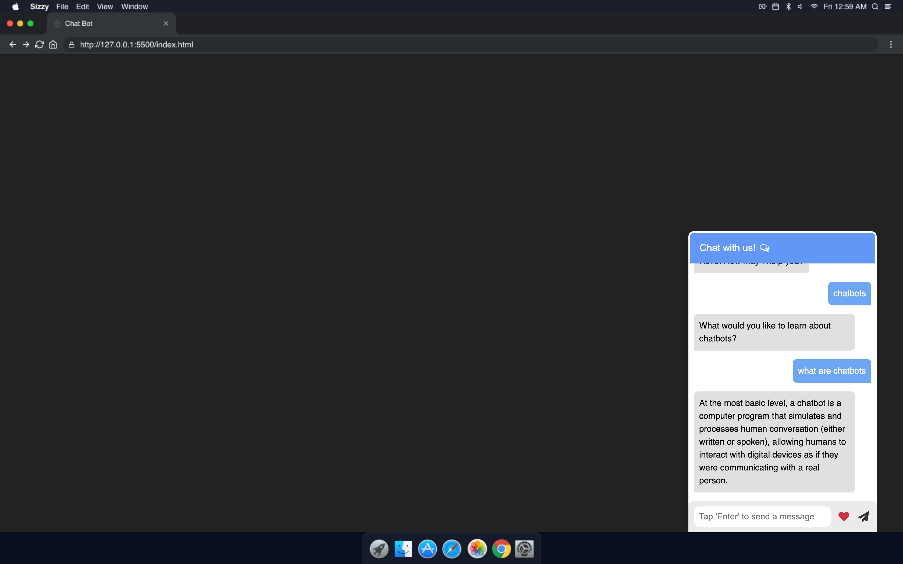

## Chatbot

At the most basic level, a chatbot is a computer program that simulates and processes human conversation (either written or spoken), allowing humans to interact with digital devices as if they were communicating with a real person.

Driven by AI, automated rules, natural-language processing (NLP), and machine learning (ML), chatbots process data to deliver responses to requests of all kinds.

## Project Specifications
A chatbot can support your HR team in a variety of tasks. On the one hand, a bot can answer questions from applicants. These could be questions about an open position, ambiguities in the application process or questions about the agreed interview meeting. 

On the other hand, a chatbot can be used for employee training. Bots offer a good opportunity to make training content more interactive than conventional training programs. In addition, every employee can learn at his or her own pace. The same applies to the topic of onboarding. New employees can also be trained or accompanied by a chatbot.

## Common Use Cases:

- Customer Service: Answering FAQs, support in case of problems.
- Marketing: Lead generation, product consulting, data collection, increase interaction
- Sales: Qualification of leads, support throughout the sales funnel
- IT Service Helpdesk: Support for internal or external service desk applications
- HR: Support in personnel development or onboarding

## Steps to execute this project:
- Download the entire code 
- Open up the index.html.
- [View Live Chatbot](https://anthonys1760.github.io/jschatbot/)

## Technologies used: 
- HTML
- CSS [style/Presentation]
- jQuery
- Javascript [Logic/flow of chatbot]
